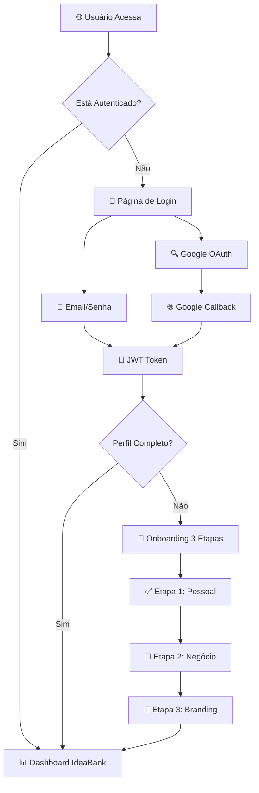
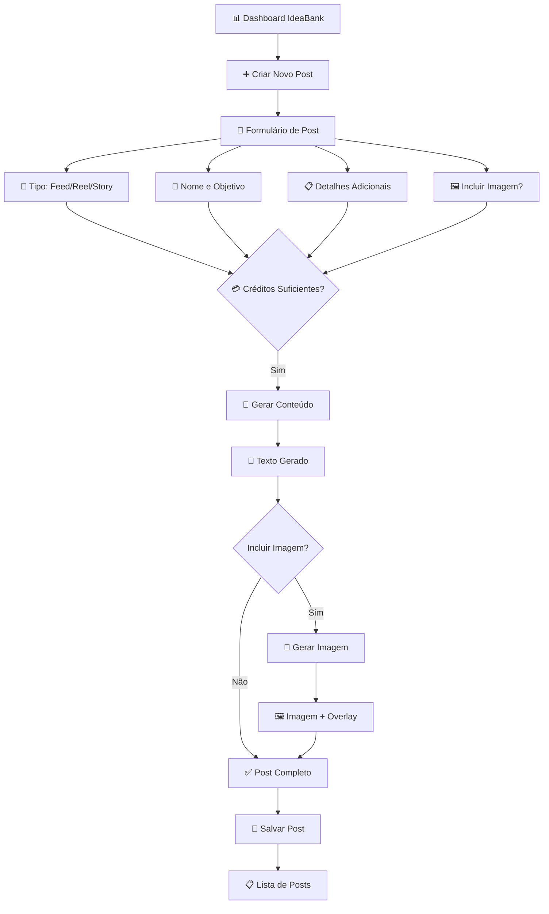
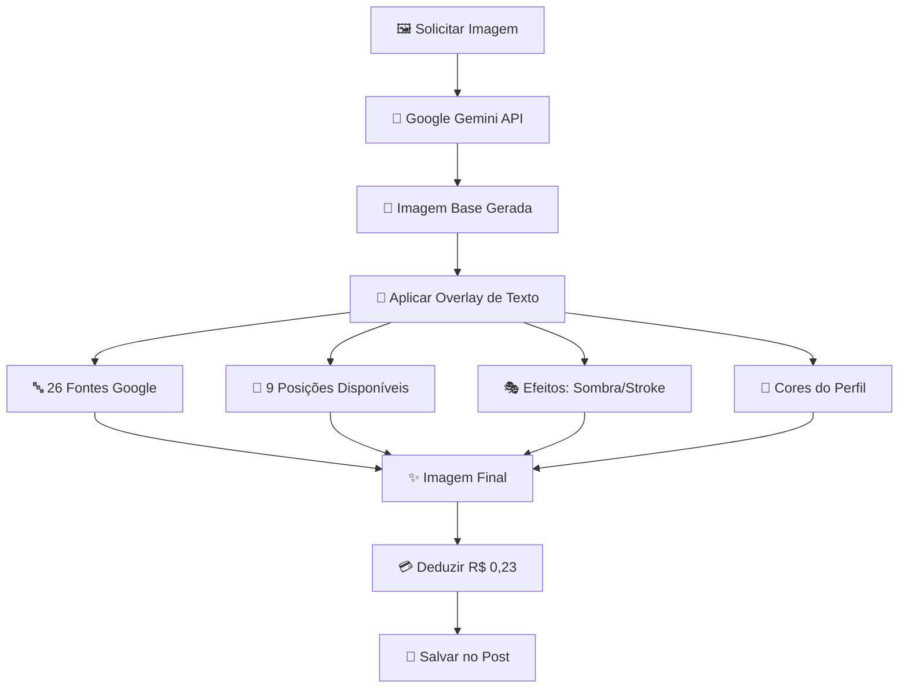

# Sonora UI - Frontend de Geração de Conteúdo com IA

Interface React moderna e responsiva para criação de conteúdo para redes sociais usando inteligência artificial. Sistema completo com autenticação, onboarding, geração de texto/imagem e gestão de créditos.

## 🎯 **Fluxo de Funcionamento do Sistema**

### **🔐 1. Processo de Autenticação**



### **🎨 2. Fluxo de Onboarding (3 Etapas)**

#### **📝 Etapa 1: Informações Pessoais**

- Nome profissional e profissão
- Instagram handle e WhatsApp
- Validação automática para próxima etapa

#### **🏢 Etapa 2: Informações do Negócio**

- Nome do negócio e especialização
- Descrição detalhada do negócio
- Definição de público-alvo (gênero, idade, localização, interesses)
- Instagram empresarial e website

#### **🎨 Etapa 3: Identidade Visual**

- Tom de voz da marca
- Paleta de 5 cores (gerada automaticamente se não definida)
- Upload de logo (opcional)

### **🤖 3. Fluxo de Geração de Conteúdo**



### **🎨 4. Sistema de Geração de Imagem**



## 🏗️ **Arquitetura do Frontend**

### **📱 Core Features**

- **🎨 Geração Inteligente**: Texto otimizado + Imagens com overlay profissional
- **💳 Sistema de Créditos**: Controle em tempo real + Compra integrada Stripe
- **👤 Perfil Dinâmico**: Onboarding guiado + Personalização automática
- **📱 Responsivo**: Desktop sidebar + Mobile hambúrguer menu
- **🌙 Tema Adaptável**: Light/Dark/Sistema com persistência
- **🔒 Segurança**: JWT + Google OAuth + Rotas protegidas

### **🔄 Estados da Aplicação**

#### **👤 AuthContext**

```typescript
interface AuthState {
  user: User | null;
  isAuthenticated: boolean;
  isLoading: boolean;
  login: (credentials) => Promise<void>;
  logout: () => void;
  refreshToken: () => Promise<void>;
}
```

#### **🎯 OnboardingContext**

```typescript
interface OnboardingState {
  currentStep: 1 | 2 | 3 | 4;
  isComplete: boolean;
  profile: CreatorProfile;
  updateStep: (step, data) => Promise<void>;
}
```

#### **🎨 ThemeContext**

```typescript
interface ThemeState {
  theme: "light" | "dark" | "system";
  setTheme: (theme) => void;
  effectiveTheme: "light" | "dark";
}
```

## 🧩 **Componentes Principais**

### **�️ Guardas de Rota**

#### **ProtectedRoute**

- Verifica autenticação JWT
- Redireciona para login se não autenticado
- Valida token automaticamente
- Integra com OnboardingProvider

#### **PublicRoute**

- Páginas acessíveis sem login
- Redireciona usuários autenticados
- Login e registro

### **📱 Layout e Navegação**

#### **DashboardLayout**

```typescript
// Layout responsivo com sidebar
interface DashboardLayoutProps {
  children: React.ReactNode
}

// Features:
- Sidebar desktop (240px fixa)
- Menu hambúrguer mobile
- Avatar do usuário + dropdown
- Navegação ativa destacada
- Indicador de créditos em tempo real
```

#### **Sidebar Navigation**

```text
📊 IdeaBank - Página principal
👤 Perfil - Gestão do perfil criador
💳 Créditos - Compra e histórico
📋 Assinatura - Planos e status
```

### **🎨 Componentes de Conteúdo**

#### **PostCreationDialog**

- Formulário modal responsivo
- Validação com Zod + React Hook Form
- Preview em tempo real
- Integração com API de créditos

#### **PostList**

- Grid responsivo de posts
- Lazy loading automático
- Filtros por tipo (Feed/Reel/Story)
- Estados de loading elegantes

#### **PostViewDialog**

- Visualização completa do post
- Opções de regeneração
- Download de imagem
- Compartilhamento social

## 📄 **Páginas e Fluxos**

### **🔐 Autenticação**

#### **LoginPage (`/login`)**

```typescript
// Fluxo de login
1. Validação de formulário (email/senha)
2. Chamada API de autenticação
3. Armazenamento de JWT em cookie seguro
4. Redirecionamento para dashboard
5. Inicialização de contextos
```

#### **RegisterPage (`/register`)**

```typescript
// Fluxo de registro
1. Validação de campos obrigatórios
2. Verificação de email único
3. Criação de conta via API
4. Login automático pós-registro
5. Redirecionamento para onboarding
```

#### **GoogleCallbackPage (`/auth/google/callback`)**

```typescript
// Processamento OAuth Google
1. Captura código de autorização
2. Troca por tokens JWT
3. Criação/atualização de usuário
4. Redirecionamento contextual
```

### **📊 Dashboard Principal**

#### **IdeaBankPage (`/ideabank`)**

```typescript
// Hub principal de conteúdo
interface IdeaBankFeatures {
  creditStatus: RealtimeCredits; // Saldo atualizado
  subscriptionStatus: PlanInfo; // Status da assinatura
  postCreation: ModalDialog; // Geração de conteúdo
  postHistory: InfiniteScroll; // Lista de posts criados
  quickActions: ButtonGroup; // Ações rápidas
}
```

### **👤 Perfil e Configurações**

#### **ProfilePage (`/profile`)**

```typescript
// Gestão completa do perfil
interface ProfileSections {
  personalInfo: EditableForm; // Etapa 1 do onboarding
  businessInfo: EditableForm; // Etapa 2 do onboarding
  brandingInfo: EditableForm; // Etapa 3 do onboarding
  accountSettings: SecurityForm; // Senha, email, etc.
  avatarUpload: ImageUpload; // Foto do perfil
}
```

### **💳 Sistema Financeiro**

#### **CreditsPage (`/credits`)**

```typescript
// Gestão de créditos
interface CreditFeatures {
  currentBalance: RealtimeDisplay; // Saldo atual
  monthlyAllocation: ProgressBar; // Créditos mensais
  purchasePackages: StripeCheckout; // Compra de pacotes
  transactionHistory: Table; // Histórico detalhado
  usageAnalytics: Charts; // Gráficos de uso
}
```

#### **SubscriptionPage (`/subscription`)**

```typescript
// Gestão de assinaturas
interface SubscriptionFeatures {
  currentPlan: PlanCard; // Plano atual
  availablePlans: PlanGrid; // Opções disponíveis
  billingHistory: InvoiceList; // Histórico de pagamentos
  cancelation: ModalDialog; // Cancelamento
  upgrade: StripeCheckout; // Upgrade de plano
}
```

## 🚀 **Início Rápido**

### **1. Instalação e Configuração**

```bash
# Clonar e instalar
git clone https://github.com/Sonora-Content-Producer/Sonora-UI.git
cd Sonora-UI
npm install

# Configurar ambiente
cp .env.example .env
```

### **2. Variáveis de Ambiente**

```env
# API Backend
VITE_API_BASE_URL=http://localhost:8000
VITE_API_VERSION=v1

# Google OAuth
VITE_GOOGLE_CLIENT_ID=your-google-client-id

# Analytics (opcional)
VITE_CLARITY_ID=your-clarity-id

# Stripe (frontend)
VITE_STRIPE_PUBLISHABLE_KEY=pk_test_...
```

### **3. Desenvolvimento**

```bash
# Servidor de desenvolvimento
npm run dev

# Build de produção
npm run build

# Preview da build
npm run preview

# Linting e formatação
npm run lint
npm run format
```

## 🛠️ **Stack Tecnológica Completa**

### **⚛️ Core Frontend**

- **React 18**: Concurrent features, Suspense, Error boundaries
- **TypeScript**: Type safety completo + interfaces robustas
- **Vite**: Build tool ultra-rápido + HMR instantâneo
- **ESLint + Prettier**: Code quality + formatação automática

### **🎨 UI e Estilização**

- **Tailwind CSS**: Utility-first styling system
- **shadcn/ui**: Componentes acessíveis e customizáveis
- **Lucide React**: Ícones consistentes e otimizados
- **CSS Variables**: Sistema de temas dinâmico

### **📝 Formulários e Validação**

- **React Hook Form**: Performance otimizada + baixo re-render
- **Zod**: Schema validation TypeScript-first
- **Validação em tempo real**: Feedback imediato ao usuário

### **🔄 Estado e Dados**

- **TanStack Query**: Cache inteligente + sincronização automática
- **React Context**: Estado global para auth/theme/onboarding
- **Optimistic Updates**: UI responsiva mesmo offline

### **🌐 Comunicação e APIs**

- **Axios**: HTTP client com interceptors
- **JWT**: Token-based authentication
- **Google OAuth**: Integração social login
- **Stripe Elements**: Checkout seguro integrado

## � **Estrutura do Projeto**

```text
src/
├── 📱 components/           # Componentes reutilizáveis
│   ├── ui/                 # Design system (shadcn/ui)
│   ├── ideabank/           # Componentes específicos do IdeaBank
│   ├── DashboardLayout.tsx # Layout principal
│   ├── ProtectedRoute.tsx  # Guarda de rotas
│   └── PublicRoute.tsx     # Rotas públicas
├── 📄 pages/               # Páginas da aplicação
│   ├── LoginPage.tsx       # Autenticação
│   ├── IdeaBankPage.tsx    # Dashboard principal
│   ├── ProfilePage.tsx     # Perfil do usuário
│   ├── CreditsPage.tsx     # Sistema de créditos
│   └── SubscriptionPage.tsx # Assinaturas
├── 🎯 contexts/            # Contextos globais
│   ├── AuthContext.tsx     # Estado de autenticação
│   ├── OnboardingContext.tsx # Fluxo de onboarding
│   └── ThemeContext.tsx    # Sistema de temas
├── 🎣 hooks/               # Hooks customizados
│   ├── useAuth.ts          # Hook de autenticação
│   ├── useCredits.ts       # Gestão de créditos
│   └── useSubscription.ts  # Gestão de assinaturas
├── 🔧 lib/                 # Utilitários e configurações
│   ├── auth.ts             # Lógica de autenticação
│   ├── api.ts              # Cliente API
│   └── utils.ts            # Funções auxiliares
├── 📊 features/            # Features organizadas por domínio
│   ├── Credits/            # Sistema de créditos
│   ├── Subscription/       # Sistema de assinaturas
│   └── IdeaBank/           # Geração de conteúdo
├── 📋 schemas/             # Schemas de validação Zod
├── 🏷️ types/               # Tipos TypeScript
└── ⚙️ providers/          # Providers da aplicação
```

## 🚀 **Características Avançadas**

### **⚡ Performance**

- **Code Splitting**: Lazy loading automático de rotas
- **Image Optimization**: Loading lazy + placeholder
- **Bundle Optimization**: Tree shaking + chunk splitting
- **Prefetching**: Dados carregados antecipadamente

### **♿ Acessibilidade**

- **ARIA Labels**: Navegação por screen readers
- **Keyboard Navigation**: Suporte completo ao teclado
- **Focus Management**: Foco inteligente em modais
- **Color Contrast**: Conformidade WCAG 2.1

### **🔒 Segurança**

- **XSS Prevention**: Sanitização automática
- **CSRF Protection**: Tokens CSRF em requisições
- **Secure Cookies**: HttpOnly + Secure + SameSite
- **Content Security Policy**: Headers de segurança

### **� Responsividade**

```css
/* Breakpoints Tailwind */
sm: 640px   /* Mobile landscape */
md: 768px   /* Tablet */
lg: 1024px  /* Desktop */
xl: 1280px  /* Large desktop */
2xl: 1536px /* Extra large */
```

### **🎨 Sistema de Temas**

```typescript
// Temas suportados
interface ThemeConfig {
  light: {
    background: "hsl(0 0% 100%)";
    foreground: "hsl(222.2 84% 4.9%)";
    primary: "hsl(222.2 47.4% 11.2%)";
    // ... mais variáveis
  };
  dark: {
    background: "hsl(222.2 84% 4.9%)";
    foreground: "hsl(210 40% 98%)";
    primary: "hsl(210 40% 98%)";
    // ... mais variáveis
  };
}
```

## 🔗 **Integração com Backend**

### **📡 Endpoints Principais**

```typescript
// Autenticação
POST /api/v1/auth/login/
POST /api/v1/auth/google/
GET  /api/v1/auth/user/

// Perfil do Criador
GET    /api/v1/creator-profile/
PATCH  /api/v1/creator-profile/step-{1,2,3}/

// Geração de Conteúdo
POST /api/v1/ideabank/generate-content/
POST /api/v1/ideabank/generate-image/

// Créditos e Assinaturas
GET  /api/v1/credits/balance/
POST /api/v1/credits/purchase/
GET  /api/v1/subscriptions/plans/
```

### **🔄 Sincronização de Estado**

- **Optimistic Updates**: UI atualizada antes da confirmação
- **Cache Invalidation**: Dados sempre atualizados
- **Background Sync**: Sincronização automática
- **Offline Support**: Funcionalidade básica offline

## 🧪 **Testes e Qualidade**

### **🔍 Ferramentas de Teste**

```bash
# Testes unitários
npm run test

# Testes E2E
npm run test:e2e

# Coverage
npm run test:coverage

# Type checking
npm run type-check
```

### **📊 Métricas de Qualidade**

- **Bundle Size**: < 500KB gzipped
- **First Contentful Paint**: < 1.5s
- **Largest Contentful Paint**: < 2.5s
- **Cumulative Layout Shift**: < 0.1

---

## 🌟 **Destaques da Experiência do Usuário**

### **✨ Micro-interações**

- Transições suaves entre páginas
- Loading states elegantes
- Feedback visual imediato
- Animações contextuais

### **🎯 Fluxo Otimizado**

- Onboarding progressivo
- Validação em tempo real
- Ações contextuais
- Navegação intuitiva

### **💡 Inteligência Integrada**

- Sugestões baseadas no perfil
- Créditos calculados automaticamente
- Temas adaptativos
- Experiência personalizada

---

_🚀 Sonora UI - Interface moderna para criação de conteúdo profissional com IA_
